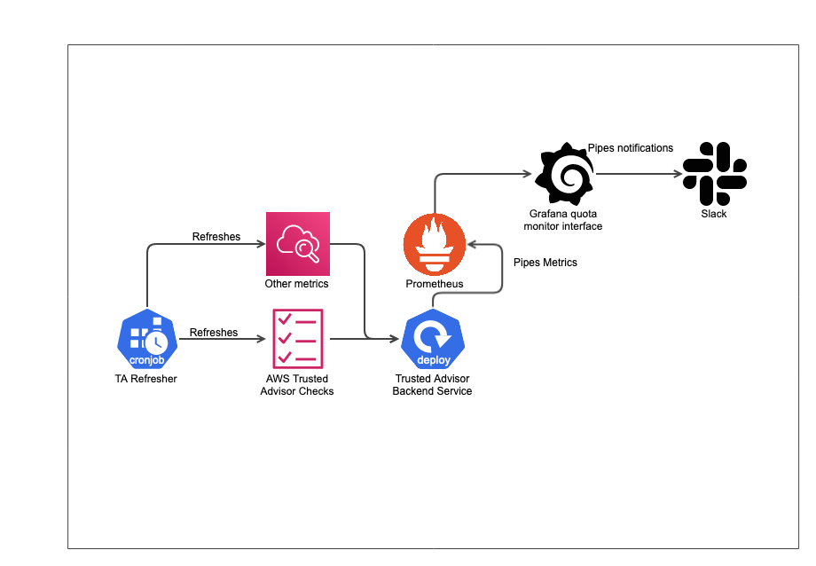
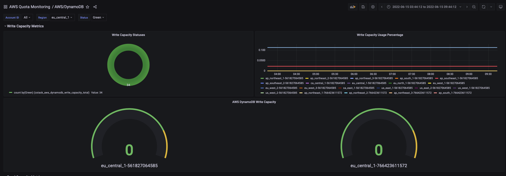
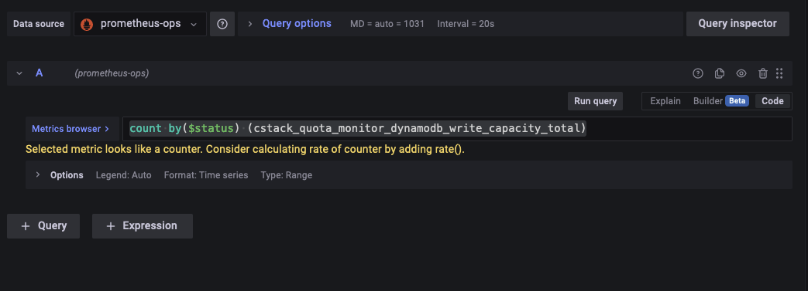
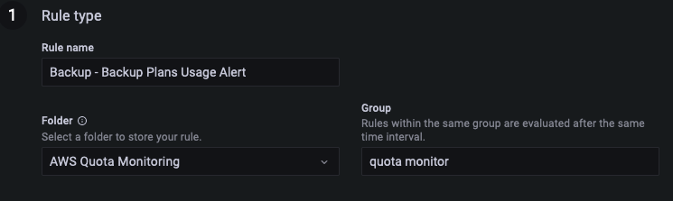
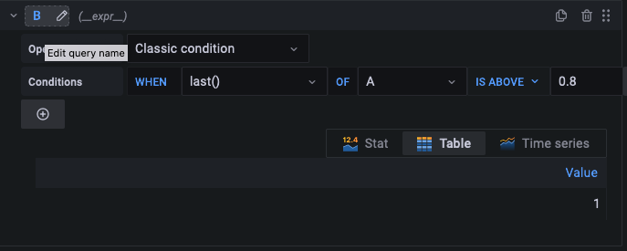
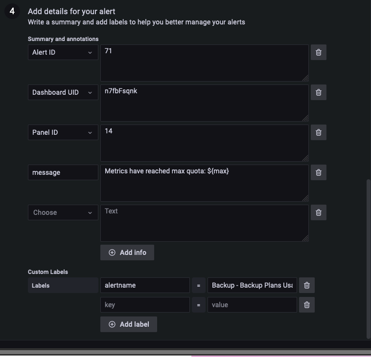

# cstack-quota-monitoring
Container Stack monitoring for Cloud Resource quota

Description
===========

This monitoring solution will make use of an existing monitoring solution used by CSTACK (Grafana) to have improved clarity over AWS Service Quotas. This monitoring solution will offer a better monitoring interface as well as alerts.

Purpose
=======

The existing solution for Service Quota monitoring (AWS management console) lacks alerting and monitoring capabilities in comparison to monitoring solutions such as Grafana. Due to "poorer" UI design in the management console and the reasons mentioned previously, the service quota metrics should be made available to be monitored and alerted via Grafana.

Implementation
==============

<table class="gliffy-macro-table" width="100%"><tbody><tr><td><table class="gliffy-macro-inner-table"><caption align="bottom"></caption><tbody><tr><td></td></tr></tbody></table></td></tr></tbody></table>

1.  A function called TA Refresher that runs once every 24 hours will refresh the [AWS Trusted Advisor](https://aws.amazon.com/premiumsupport/technology/trusted-advisor/) Service Limits checks to retrieve the most current utilization and quota data through API calls. Trusted Advisor calculates usage against the quota to determine whether the status is OK (less than 80% utilization), WARN (between 80% and 99% utilization), or ERROR (100% utilization). The interval of the TA Refresher can be configured as it's triggered via CronJobs. Additionally, this function will also refresh the Prometheus metrics in the application.  
    1.  Additionally, this function is required to allow Trusted Advisor to refresh the check results, since it only checks every 24 hours by default.
2.  The metrics from Trusted Advisor and other metrics will be piped to Prometheus via the back-end "Quota Monitor" service, which will be consumed by Grafana to visualize the metrics.
3.  Alerts can be set up for the metrics to alert us on the quotas, which can be notified via Slack and SNS.

Reference:

*   [https://docs.aws.amazon.com/awssupport/latest/user/cloudwatch-metrics-ta.html#trusted-advisor-metrics-dimensions](https://docs.aws.amazon.com/awssupport/latest/user/cloudwatch-metrics-ta.html#trusted-advisor-metrics-dimensions)

  

How to use?
===========

To monitor the metrics, we simply have to access the Grafana dashboards under the namespace `Usage/AWS Quota Monitor.`



  

Configuration Options
=====================

ENV Variables
-------------

*   `REGION_WHITELIST`
    *   This variable is for whitelisting only certain regions for monitoring. Leave empty if we want to monitor all regions. Regions must be inputted as seen in AWS documentation (eg. ap-southeast-1)
*   `AWS_SERVICES`
    *   This variable is for whitelisting only certain services. Leave empty if we want to monitor all AWS services supported by the application (refer to metric metadata configuration file. Services must be inputted as seen in AWS service codes (eg. s3, backup)
*   ACCESS\_KEYS and SECRET\_KEYS
    *   These variables are retrieved from sealed secrets, where each entry in both array corresponds with 1 account. (eg. `[access_key_1,...]`  , `[secret_key_1,...]` the two elements are used to access an AWS account.  )
*   `metric_metadata.json`
    *   This JSON file is used to modify the metrics that we're adding or removing to the application. More configuration options for this file can be seen below.

  

How do we add metrics?
======================

One main issue with this solution is the manual update process for adding new services. As Trusted Advisor lacks a few key services that we'd like to monitor, we implement monitoring for these services through APIs. To add new metrics, we have to first decide what type of metric we'd like to add.

Adding TA Metrics
-----------------

Adding Trusted Advisor metrics is simple. We only have to update the JSON config file to add in a new TA metric, as seen below.

**metric\_metadata.json** 

```js
{
    "checks": {
        "ta_metrics": {
            "ec2": {
                "cstack_quota_monitor_ec2_on_demand_instances_total": {
                    "id": "0Xc6LMYG8P",
                    "description": "Checks for usage that is more than 80% of the EC2 On-Demand Instances Limit. Values are based on a snapshot, so your current usage might differ. Limit and usage data can take up to 24 hours to reflect any changes. In cases where limits have been recently increased, you may temporarily see utilization that exceeds the limit.",
                    "metricName": "cstack_quota_monitor_ec2_on_demand_instances_total"
                },
                "cstack_quota_monitor_ec2_reserved_instance_leases_total": {
                    "id": "iH7PP0l7J9",
                    "description": "Checks for usage that is more than 80% of the EC2 Reserved Instance Leases Limit. Values are based on a snapshot, so your current usage might differ. Limit and usage data can take up to 24 hours to reflect any changes. In cases where limits have been recently increased, you may temporarily see utilization that exceeds the limit.",
                    "metricName": "cstack_quota_monitor_ec2_reserved_instance_leases_total"
                }
            },
            "ses": {
                "cstack_quota_monitor_ses_daily_sending_quota_total": {
                    "id": "hJ7NN0l7J9",
                    "description": "Checks for usage that is more than 80% of the SES Daily Sending Quota Limit. Values are based on a snapshot, so your current usage might differ. Limit and usage data can take up to 24 hours to reflect any changes. In cases where limits have been recently increased, you may temporarily see utilization that exceeds the limit.",
                    "metricName": "cstack_quota_monitor_ses_daily_sending_quota_total"
                }
            },
            "ebs": {
                "cstack_quota_monitor_ebs_provisioned_iops_ssd_volume_aggregate_iops_total": {
                    "id": "tV7YY0l7J9",
                    "description": "Checks for usage that is more than 80% of the EBS Provisioned IOPS (SSD) Volume Aggregate IOPS Limit. Values are based on a snapshot, so your current usage might differ. Limit and usage data can take up to 24 hours to reflect any changes. In cases where limits have been recently increased, you may temporarily see utilization that exceeds the limit.",
                    "metricName": "cstack_quota_monitor_ebs_provisioned_iops_ssd_volume_aggregate_iops_total"
                },
                "cstack_quota_monitor_ebs_provisioned_iops_ssd_io1_volume_storage_total": {
                    "id": "gI7MM0l7J9",
                    "description": "Checks for usage that is more than 80% of the EBS Provisioned IOPS SSD (io1) Volume Storage Limit. Values are based on a snapshot, so your current usage might differ. Limit and usage data can take up to 24 hours to reflect any changes. In cases where limits have been recently increased, you may temporarily see utilization that exceeds the limit.",
                    "metricName": "cstack_quota_monitor_ebs_provisioned_iops_ssd_io1_volume_storage_total"
                },
                "cstack_quota_monitor_ebs_active_snapshots_total": {
                    "id": "eI7KK0l7J9",
                    "description": "Checks for usage that is more than 80% of the EBS Active Snapshots Limit. Values are based on a snapshot, so your current usage might differ. Limit and usage data can take up to 24 hours to reflect any changes. In cases where limits have been recently increased, you may temporarily see utilization that exceeds the limit.",
                    "metricName": "cstack_quota_monitor_ebs_active_snapshots_total"
                },
                "cstack_quota_monitor_ebs_general_purpose_ssd_gp2_volume_storage_total": {
                    "id": "dH7RR0l6J9",
                    "description": "Checks for usage that is more than 80% of the EBS General Purpose SSD (gp2) Volume Storage Limit. Values are based on a snapshot, so your current usage might differ. Limit and usage data can take up to 24 hours to reflect any changes. In cases where limits have been recently increased, you may temporarily see utilization that exceeds the limit.",
                    "metricName": "cstack_quota_monitor_ebs_general_purpose_ssd_gp2_volume_storage_total"
                },
                "cstack_quota_monitor_ebs_magnetic_standard_volume_storage_total": {
                    "id": "cG7HH0l7J9",
                    "description": "Checks for usage that is more than 80% of the EBS Magnetic (standard) Volume Storage Limit. Values are based on a snapshot, so your current usage might differ. Limit and usage data can take up to 24 hours to reflect any changes. In cases where limits have been recently increased, you may temporarily see utilization that exceeds the limit.",
                    "metricName": "cstack_quota_monitor_ebs_magnetic_standard_volume_storage_total"
                },
                "cstack_quota_monitor_ebs_throughput_optimized_hdd_st1_volume_storage_total": {
                    "id": "wH7DD0l3J9",
                    "description": "Checks for usage that is more than 80% of the EBS Throughput Optimized HDD (st1) Volume Storage Limit. Values are based on a snapshot, so your current usage might differ. Limit and usage data can take up to 24 hours to reflect any changes. In cases where limits have been recently increased, you may temporarily see utilization that exceeds the limit.",
                    "metricName": "cstack_quota_monitor_ebs_throughput_optimized_hdd_st1_volume_storage_total"
                },
                "cstack_quota_monitor_ebs_cold_hdd_sc1_volume_storage_total": {
                    "id": "gH5CC0e3J9",
                    "description": "Checks for usage that is more than 80% of the EBS Cold HDD (sc1) Volume Storage Limit. Values are based on a snapshot, so your current usage might differ. Limit and usage data can take up to 24 hours to reflect any changes. In cases where limits have been recently increased, you may temporarily see utilization that exceeds the limit.",
                    "metricName": "cstack_quota_monitor_ebs_cold_hdd_sc1_volume_storage_total"
                }
            },
            "vpc": {
                "cstack_quota_monitor_vpc_total": {
                    "id": "jL7PP0l7J9",
                    "description": "Checks for usage that is more than 80% of the VPC Limit. Values are based on a snapshot, so your current usage might differ. Limit and usage data can take up to 24 hours to reflect any changes. In cases where limits have been recently increased, you may temporarily see utilization that exceeds the limit.",
                    "metricName": "cstack_quota_monitor_vpc_total"
                },
                "cstack_quota_monitor_vpc_internet_gateways_total": {
                    "id": "kM7QQ0l7J9",
                    "description": "Checks for usage that is more than 80% of the VPC Internet Gateways Limit. Values are based on a snapshot, so your current usage might differ. Limit and usage data can take up to 24 hours to reflect any changes. In cases where limits have been recently increased, you may temporarily see utilization that exceeds the limit.",
                    "metricName": "cstack_quota_monitor_vpc_internet_gateways_total"
                },
                "cstack_quota_monitor_ec2_vpc_elastic_ip_address_total": {
                    "id": "lN7RR0l7J9",
                    "description": "Checks for usage that is more than 80% of the EC2-VPC Elastic IP Address Limit. Values are based on a snapshot, so your current usage might differ. Limit and usage data can take up to 24 hours to reflect any changes. In cases where limits have been recently increased, you may temporarily see utilization that exceeds the limit.",
                    "metricName": "cstack_quota_monitor_ec2_vpc_elastic_ip_address_total"
                }
            },
            "elb": {
                "cstack_quota_monitor_elb_classic_load_balancers_total": {
                    "id": "iK7OO0l7J9",
                    "description": "Checks for usage that is more than 80% of the ELB Classic Load Balancers. Application Load Balancers and Network Load Balancers have a separate limit. Values are based on a snapshot, so your current usage might differ. Limit and usage data can take up to 24 hours to reflect any changes. In cases where limits have been recently increased, you may temporarily see utilization that exceeds the limit.",
                    "metricName": "cstack_quota_monitor_elb_classic_load_balancers_total"
                },
                "cstack_quota_monitor_elb_application_load_balancers_total": {
                    "id": "EM8b3yLRTr",
                    "description": "Checks for usage that is more than 80% of the ELB Application Load Balancers Limit. Classic Load Balancers and Network Load Balancers have separate limits. Values are based on a snapshot, so your current usage might differ. Limit and usage data can take up to 24 hours to reflect any changes. In cases where limits have been recently increased, you may temporarily see utilization that exceeds the limit.",
                    "metricName": "cstack_quota_monitor_elb_application_load_balancers_total"
                },
                "cstack_quota_monitor_elb_network_load_balancers_total": {
                    "id": "8wIqYSt25K",
                    "description": "Checks for usage that is more than 80% of the ELB Network Load Balancers Limit. Classic Load Balancers and Application Load Balancers have separate limits. Values are based on a snapshot, so your current usage might differ. Limit and usage data can take up to 24 hours to reflect any changes. In cases where limits have been recently increased, you may temporarily see utilization that exceeds the limit.",
                    "metricName": "cstack_quota_monitor_elb_network_load_balancers_total"
                }
            },
            "rds": {
                "cstack_quota_monitor_rds_cluster_roles_total": {
                    "id": "7fuccf1Mx7",
                    "description": "Checks for usage that is more than 80% of the RDS Cluster Roles Limit. Values are based on a snapshot, so your current usage might differ. Limit and usage data can take up to 24 hours to reflect any changes. In cases where limits have been recently increased, you may temporarily see utilization that exceeds the limit.",
                    "metricName": "cstack_quota_monitor_rds_cluster_roles_total"
                },
                "cstack_quota_monitor_rds_cluster_parameter_groups_total": {
                    "id": "jtlIMO3qZM",
                    "description": "Checks for usage that is more than 80% of the RDS Cluster Parameter Groups Limit. Values are based on a snapshot, so your current usage might differ. Limit and usage data can take up to 24 hours to reflect any changes. In cases where limits have been recently increased, you may temporarily see utilization that exceeds the limit.",
                    "metricName": "cstack_quota_monitor_rds_cluster_parameter_groups_total"
                },
                "cstack_quota_monitor_rds_clusters_total": {
                    "id": "gjqMBn6pjz",
                    "description": "Checks for usage that is more than 80% of the RDS Clusters Limit. Values are based on a snapshot, so your current usage might differ. Limit and usage data can take up to 24 hours to reflect any changes. In cases where limits have been recently increased, you may temporarily see utilization that exceeds the limit.",
                    "metricName": "cstack_quota_monitor_rds_clusters_total"
                },
                "cstack_quota_monitor_rds_reserved_instances_total": {
                    "id": "UUDvOa5r34",
                    "description": "Checks for usage that is more than 80% of the RDS Reserved Instances Limit. Values are based on a snapshot, so your current usage might differ. Limit and usage data can take up to 24 hours to reflect any changes. In cases where limits have been recently increased, you may temporarily see utilization that exceeds the limit.",
                    "metricName": "cstack_quota_monitor_rds_reserved_instances_total"
                },
                "cstack_quota_monitor_rds_subnets_per_subnet_group_total": {
                    "id": "jEhCtdJKOY",
                    "description": "Checks for usage that is more than 80% of the RDS Subnets per Subnet Group Limit. Values are based on a snapshot, so your current usage might differ. Limit and usage data can take up to 24 hours to reflect any changes. In cases where limits have been recently increased, you may temporarily see utilization that exceeds the limit.",
                    "metricName": "cstack_quota_monitor_rds_subnets_per_subnet_group_total"
                },
                "cstack_quota_monitor_rds_subnet_groups_total": {
                    "id": "dYWBaXaaMM",
                    "description": "Checks for usage that is more than 80% of the RDS Subnet Groups Limit. Values are based on a snapshot, so your current usage might differ. Limit and usage data can take up to 24 hours to reflect any changes. In cases where limits have been recently increased, you may temporarily see utilization that exceeds the limit.",
                    "metricName": "cstack_quota_monitor_rds_subnet_groups_total"
                },
                "cstack_quota_monitor_rds_option_groups_total": {
                    "id": "3Njm0DJQO9",
                    "description": "Checks for usage that is more than 80% of the RDS Option Groups Limit. Values are based on a snapshot, so your current usage might differ. Limit and usage data can take up to 24 hours to reflect any changes. In cases where limits have been recently increased, you may temporarily see utilization that exceeds the limit.",
                    "metricName": "cstack_quota_monitor_rds_option_groups_total"
                },
                "cstack_quota_monitor_rds_event_subscriptions_total": {
                    "id": "keAhfbH5yb",
                    "description": "Checks for usage that is more than 80% of the RDS Event Subscriptions Limit. Values are based on a snapshot, so your current usage might differ. Limit and usage data can take up to 24 hours to reflect any changes. In cases where limits have been recently increased, you may temporarily see utilization that exceeds the limit.",
                    "metricName": "cstack_quota_monitor_rds_event_subscriptions_total"
                },
                "cstack_quota_monitor_rds_db_manual_snapshots_total": {
                    "id": "dV84wpqRUs",
                    "description": "Checks for usage that is more than 80% of the RDS DB Manual Snapshots Limit. Values are based on a snapshot, so your current usage might differ. Limit and usage data can take up to 24 hours to reflect any changes. In cases where limits have been recently increased, you may temporarily see utilization that exceeds the limit.",
                    "metricName": "cstack_quota_monitor_rds_db_manual_snapshots_total"
                },
                "cstack_quota_monitor_rds_total_storage_quota_total": {
                    "id": "P1jhKWEmLa",
                    "description": "Checks for usage that is more than 80% of the RDS Total Storage Quota Limit. Values are based on a snapshot, so your current usage might differ. Limit and usage data can take up to 24 hours to reflect any changes. In cases where limits have been recently increased, you may temporarily see utilization that exceeds the limit.",
                    "metricName": "cstack_quota_monitor_rds_total_storage_quota_total"
                },
                "cstack_quota_monitor_rds_db_parameter_groups_total": {
                    "id": "jEECYg2YVU",
                    "description": "Checks for usage that is more than 80% of the RDS DB Parameter Groups Limit. Values are based on a snapshot, so your current usage might differ. Limit and usage data can take up to 24 hours to reflect any changes. In cases where limits have been recently increased, you may temporarily see utilization that exceeds the limit.",
                    "metricName": "cstack_quota_monitor_rds_db_parameter_groups_total"
                },
                "cstack_quota_monitor_rds_read_replicas_per_master_total": {
                    "id": "pYW8UkYz2w",
                    "description": "Checks for usage that is more than 80% of the RDS Read Replicas per Master Limit. Values are based on a snapshot, so your current usage might differ. Limit and usage data can take up to 24 hours to reflect any changes. In cases where limits have been recently increased, you may temporarily see utilization that exceeds the limit.",
                    "metricName": "cstack_quota_monitor_rds_read_replicas_per_master_total"
                },
                "cstack_quota_monitor_rds_db_security_groups_total": {
                    "id": "gfZAn3W7wl",
                    "description": "Checks for usage that is more than 80% of the RDS DB Security Groups Limit. Values are based on a snapshot, so your current usage might differ. Limit and usage data can take up to 24 hours to reflect any changes. In cases where limits have been recently increased, you may temporarily see utilization that exceeds the limit.",
                    "metricName": "cstack_quota_monitor_rds_db_security_groups_total"
                },
                "cstack_quota_monitor_rds_db_instances_total": {
                    "id": "XG0aXHpIEt",
                    "description": "Checks for usage that is more than 80% of the RDS DB Instances Limit. Values are based on a snapshot, so your current usage might differ. Limit and usage data can take up to 24 hours to reflect any changes. In cases where limits have been recently increased, you may temporarily see utilization that exceeds the limit.",
                    "metricName": "cstack_quota_monitor_rds_db_instances_total"
                },
                "cstack_quota_monitor_rds_max_auths_per_security_group_total": {
                    "id": "dBkuNCvqn5",
                    "description": "Checks for usage that is more than 80% of the RDS Max Auths per Security Group Limit. Values are based on a snapshot, so your current usage might differ. Limit and usage data can take up to 24 hours to reflect any changes. In cases where limits have been recently increased, you may temporarily see utilization that exceeds the limit.",
                    "metricName": "cstack_quota_monitor_rds_max_auths_per_security_group_total"
                }
            },
            "dynamodb": {
                "cstack_quota_monitor_dynamodb_read_capacity_total": {
                    "id": "6gtQddfEw6",
                    "description": "Checks for usage that is more than 80% of the DynamoDB Provisioned Throughput Limit for Reads per Account. Values are based on a snapshot, so your current usage might differ. Limit and usage data can take up to 24 hours to reflect any changes. In cases where limits have been recently increased, you may temporarily see utilization that exceeds the limit.",
                    "metricName": "cstack_quota_monitor_dynamodb_read_capacity_total"
                },
                "cstack_quota_monitor_dynamodb_write_capacity_total": {
                    "id": "c5ftjdfkMr",
                    "description": "Checks for usage that is more than 80% of the DynamoDB Provisioned Throughput Limit for Writes per Account. Values are based on a snapshot, so your current usage might differ. Limit and usage data can take up to 24 hours to reflect any changes. In cases where limits have been recently increased, you may temporarily see utilization that exceeds the limit.",
                    "metricName": "cstack_quota_monitor_dynamodb_write_capacity_total"
                }
            }
        },
        "non_ta_metrics": {
            "backup": {
                "cstack_quota_monitor_backup_backup_plans_total": {
                    "id": null,
                    "description": "Checks for usage that is more than 80% of Backup Plan usage. Values are based on a snapshot, so your current usage might differ. Limit and usage data can take up to 24 hours to reflect any changes. In cases where limits have been recently increased, you may temporarily see utilization that exceeds the limit.",
                    "metricName": "cstack_quota_monitor_backup_backup_plans_total",
                    "customQuotas": {
                        "561827064585": {},
                        "766423611572": {
                            "ap-southeast-1": 100
                        }
                    }
                },
                "cstack_quota_monitor_backup_backup_vaults_total": {
                    "id": null,
                    "description": "Checks for usage that is more than 80% of Backup Vaults usage. Values are based on a snapshot, so your current usage might differ. Limit and usage data can take up to 24 hours to reflect any changes. In cases where limits have been recently increased, you may temporarily see utilization that exceeds the limit.",
                    "metricName": "cstack_quota_monitor_backup_backup_vaults_total",
                    "customQuotas": {
                        "561827064585": {},
                        "766423611572": {
                            "ap-southeast-1": 1000
                        }
                    }
                }
            },
            "ec2": {
                "cstack_quota_monitor_ec2_vcpu_count_total": {
                    "id": null,
                    "description": "Checks for usage that is more than 80% of EC2 VCPU usage (vCPU count). Values are based on a snapshot, so your current usage might differ. Limit and usage data can take up to 24 hours to reflect any changes. In cases where limits have been recently increased, you may temporarily see utilization that exceeds the limit.",
                    "metricName": "cstack_quota_monitor_ec2_vcpu_count_total"
                }
            },
            "s3": {
                "cstack_quota_monitor_s3_bucket_count_total": {
                    "id": null,
                    "description": "Checks for usage that is more than 80% of the total bucket count.",
                    "metricName": "cstack_quota_monitor_s3_bucket_count_total",
                    "customQuotas": {
                        "561827064585": {},
                        "766423611572": 1000
                    }
                }
            }
        }
    }
}
```

  

1.  If we are adding a new service, we add a new object into the JSON file with the service code as the key.
2.  Then we add a new metric as the metric name for the key, and then adding an id, description and metric name into the metadata. Ensure that the metric name is prefixed with `cstack_quota_monitor`
3.  When we run the application, it will automatically register that metric if configured correctly.

Adding a non-TA metric
----------------------

Adding a new non-TA metric has a few additional steps aside from the ones above.

1.  Same steps as above
    1.  customQuotas: You can add custom quotas for the metric if the applied quota values are not available.
    2.  First, add the accountIds as the keys and another object to contain the regions.
    3.  Under the region with the applied quota value, enter the quota value.
2.  Add the metric code into `other_metric.js`
    1.  Based on the code template below, add the required fields.
    2.  **other\_metrics.js**
        
        ```js
        // in constructor code
        this.quotaCodes = {
                    s3: {
                        buckets: 'L-DC2B2D3D'
                    },
                    backup: {
                        vaults: 'L-7705D2CB',
                        plans: 'L-BD69F607'
                    }
                }
        
        ...
        //Example function for metric implementation
        async #example_function() {
                //get metric required, using backup as example.
                let metricMetaData = this.metricMetaDatas.backup.{metric-name};
        				logger.log("DEBUG", `Current Metric: ${metricMetadata.metricName}`)
        
                //loop through regions if required.
                for (let region of this.awsRegionCodes()) {
                    try {
                        //if there's a custom quota set up in the JSON file, read it.
                        let serviceQuotaMax = Number(metricMetaData.customQuotas[this.accountId][region]);
                        //else get AWS Default Quota
                        if (!serviceQuotaMax) serviceQuotaMax = await this.get_quota(this.quotaCodes.{service}.{quota-name}, {service});
                        //get usage data, access and secret keys here are required for the data to be populated correctly. 
                        //Replace the usage data below with your own method of retrieving usage data.
        								//======================================================================================================
                        let backup = new AWS.Backup({ region: region, accessKeyId: this.accessKeyId, secretAccessKey: this.secretAccessKey });
                        const response = await backup.listBackupPlans().promise();
                        //usage data
                        const usage = response.BackupPlansList.length
        								//======================================================================================================
        
                        //create prometheus metric
                        let status = promMetrics.calculateUsageStatus(usage, serviceQuotaMax);
                        let labels = { region: region, status: status, accountId: this.accountId }
                        promMetrics.convertToPrometheusMetrics(metricMetaData.metricName, metricMetaData.description, labels, usage)
                        promMetrics.convertToPrometheusMetrics(metricMetaData.metricName + "_max", metricMetaData.description, labels, serviceQuotaMax)

                    }
                    catch (e) {
                    }
                }
            }
        ```
        
    3.  Add the quota code required into the `quotaCodes` JSON, then replace the fields required.
    4.  Things to update: 
        1.  "{metricName}" - replace with the metric name applied in the config JSON file.
        2.  "{`service`}" and "{`quota-name`}" - replace service with the aws service code and quota-name with quota name placed in `quotaCodes`
            
        3.  Usage data retrieval - replace the code to retrieve usage data with your own methods. The data should be an integer under the variable `usage`.
            
    5.  Add the function into the `register_all_metrics` function.
        
        **other\_metrics.js**
        
        ```js
         /**
             * Helper function to contain all metrics registered in the file. To use a new metric, place it in this function.
             */
            async register_all_metrics() {
                //runs all register metrics
                this.register_s3_buckets_metrics();
                this.register_backup_plans_metrics();
                this.register_backup_vaults_metrics()
        		//add new metrics here
            }
        ```
        

Monitoring and Alerting
=======================

Monitoring and alerting are both done on Grafana.

Adding new dashboards should use the data source `prometheus-ops.`



A Grafana dashboard template has been provided in the `Grafana Template` folder where the placeholders can be replaced.

Creating a new alert can be quite a manual process (as of Grafana v8.x). However, the process is as such:
1. Fill up metadata

2. Create query for metric - the current set up uses a simple query as seen below.
```
{metric} / {metric}_max
```
Then the second expression can be left as seen below:


3. Fill up the rest of the metadata for the alert.

  

  

Issues
======

1.  The greatest issue at the moment is retrieving applied quota values. Some quotas do not have their applied quotas available, hence we have to set the quotas manually. 
    1.  We are able to place custom quotas in the JSON configuration file, but this may be inefficient to manage in the long run.
    2.  Secondly, these custom quotas cannot be used in Grafana (as of versions < 8.x) for alerting. Hence, the quotas have to be hard-coded in the query. In later versions, templating and using variables in alerts may be possible.
2.  Currently the way that we use to configure the AWS accounts to monitor isn't practical (using two separate arrays of credentials). Another way should be considered and implemented in the future.
3.  the TA refresh function only allows us to refresh every 1 hour(API limitation). If our needs require the refresh interval to be lower, other data sources can be considered instead of TA.

  

Pages
=====

*   [AWS Limit Monitor Proposed Architecture Draft](https://confluence.ship.gov.sg/display/GovKube/AWS+Limit+Monitor+Proposed+Architecture+Draft)
*   [AWS Service Quota Limitation](AWS-Service-Quota-Limitation_657163136.html)
*   [AWS TA Endpoint Responses](https://confluence.ship.gov.sg/display/GovKube/AWS+TA+Endpoint+Responses)
